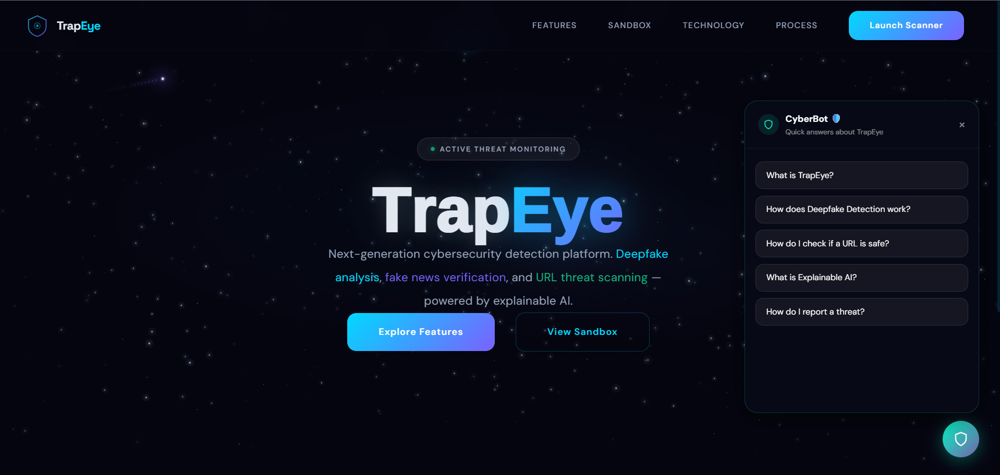
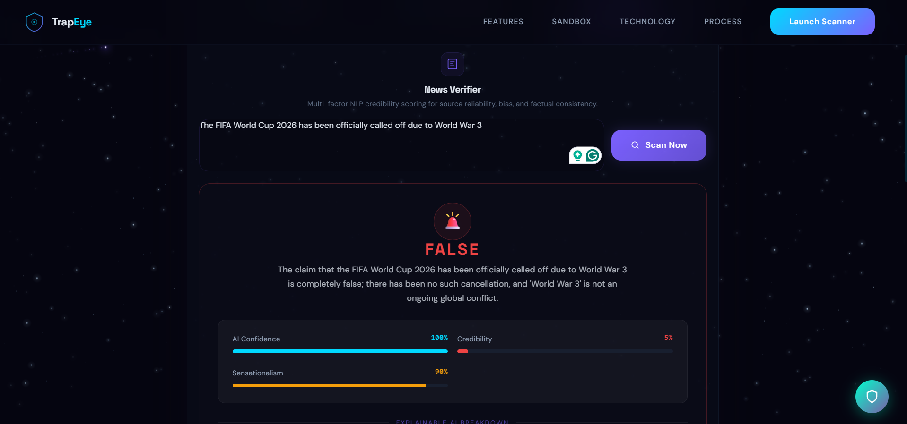
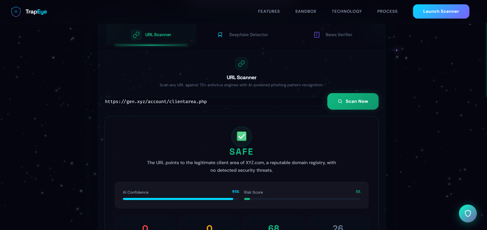
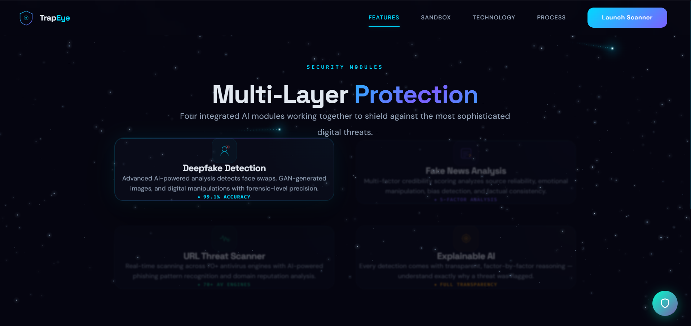
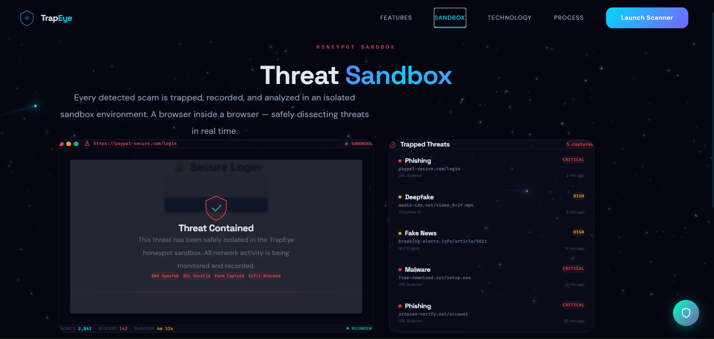
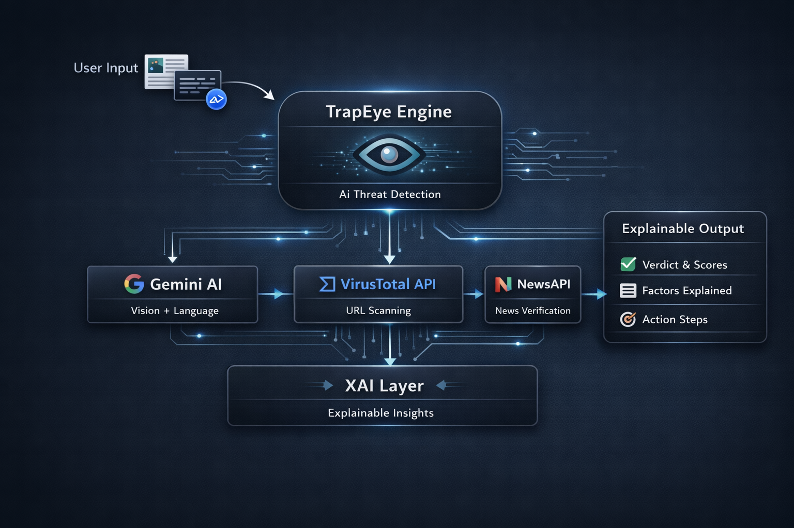

# TrapEye — AI-Powered Scam & Misinformation Detection

<p align="center">
  <em>“Not everything you see is real. TrapEye makes sure you know the difference.”</em>
</p>

TrapEye is an AI-powered threat detection platform designed to identify deepfakes, fake news, phishing URLs, and digital manipulation before harm occurs. Built with accessibility in mind for elderly users and students, it combines Google Gemini's vision and language capabilities with VirusTotal and NewsAPI to deliver explainable, real-time threat assessments.

---

<p align="center">
  
  
  
  
  
  
  
  
</p>

---

## Why TrapEye Exists

Digital deception is evolving faster than awareness.

From AI-generated faces to manipulative headlines and phishing links — misinformation today is engineered, not accidental.

TrapEye empowers users to:
- Detect threats **before damage occurs**
- Understand results through **Explainable AI**
- Make **informed decisions instantly**

---

## Screenshots & UI Preview

### Dashboard
<p align="center">
  
</p>

---

### 📰 Fake News Detector
<p align="center">
  
</p>

---

### 🔗 URL Threat Scanner
<p align="center">
  
</p>

---

### 🧩 Features Overview
<p align="center">
  
</p>

---

### 🧪 Sandbox Environment
<p align="center">
  
</p>

---

## Architecture Diagram

<p align="center">
  
</p>

---

## 🧩 Core Features

### 🖼️ Deepfake Detection
Upload any image (JPG, PNG, WebP) and receive an AI-driven forensic analysis powered by Gemini Vision.

- Detects GAN-generated images (StyleGAN, Stable Diffusion, Midjourney, etc.)
- Identifies face-swapping artifacts (DeepFaceLab, FaceSwap, etc.)
- Analyzes facial consistency, lighting coherence, texture detail, edge boundaries, and background integrity
- Returns a verdict of REAL, FAKE, or SUSPICIOUS with a confidence score and manipulation score
- Provides a factor-by-factor XAI breakdown and a practical recommendation 

**Output:** `REAL / FAKE / SUSPICIOUS`  
+ Confidence Score  
+ Manipulation Score  
+ Explainable Breakdown  

---

### 📰 Fake News Intelligence
Evaluate the credibility of news content by entering a headline, full article text, or article URL.

- Cross-references headlines against live news databases via NewsAPI
- Scores credibility (0–100%), political bias (left to right scale), and sensationalism level
- Identifies red flags (emotional manipulation, missing context, logical inconsistencies) and positive credibility signals  

**Output:**  
`TRUE / FALSE / MISLEADING / SATIRE / UNVERIFIABLE`

---

### 🔗 URL Threat Scanner
Paste any URL — including shortened links, email links, or suspected phishing URLs — for a multi-layered security scan.

- Checks against 70+ antivirus engines via VirusTotal API v3
- Performs AI analysis of domain reputation, URL structure, phishing indicators, redirect chain risk, and content patterns
- Provides a verdict of SAFE, SUSPICIOUS, DANGEROUS, PHISHING, or MALWARE
- Displays a full URL breakdown (protocol, domain, path, query parameters) before scanning
- Gives a clear safe/do-not-visit recommendation with technical indicators

**Output:**  
`SAFE / SUSPICIOUS / DANGEROUS / PHISHING / MALWARE`

---

### 🧠 Explainable AI (XAI)
Every scan produces a structured explanation panel showing:

- What the AI detected
- Why it reached its conclusion, factor by factor
- Confidence levels per factor
- Recommended next steps  

---

## Tech Stack

### Core Technologies
<p align="center">
  
</p>

---

### 🤖 AI & APIs
<p align="center">
  
</p>

<p align="center">
  <b>Google Gemini</b> • <b>VirusTotal API</b> • <b>NewsAPI</b>
</p>

---

### ☁️ Deployment
<p align="center">
  
</p>

---

## Project Structure

```

TrapEye-Demo/
├── app.py
├── requirements.txt
├── frontend/
├── assets/
│   ├── dashboard.png
│   ├── fakenewsdetector.png
│   ├── features.png
│   ├── sandbox.png
│   ├── urlscanner.png
│   ├── demo.gif
│   ├── demo-thumbnail.png
│   └── architecture.png
└── README.md

````

---

## 🚀 Local Setup

```bash
git clone https://github.com/angelina-2206/TrapEye-Demo.git
cd TrapEye-Demo
pip install -r requirements.txt
streamlit run app.py
````

---

## 🔐 API Configuration

<p align="center">
  
</p>

### Required Keys:

* **GEMINI_API_KEY** → AI Detection Engine
* **NEWS_API_KEY** → News Verification
* **VIRUSTOTAL_KEY** → URL Threat Intelligence

### Setup (Environment Variables)

```bash
export GEMINI_API_KEY=your_key
export NEWS_API_KEY=your_key
export VIRUSTOTAL_KEY=your_key
```

---

## ⚠️ Limitations

* AI-based detection is not forensic proof
* Results may require manual verification
* API rate limits may affect performance

---

## Target Users

* Elderly users are vulnerable to scams
* Students exposed to misinformation
* Everyday internet users

---

## Final Note

<p align="center">
  <em>“In a world where anything can be generated, truth needs verification.”</em>
</p>

<p align="center">
  ❤️ Made with love by Team DropOuts
</p>
```
